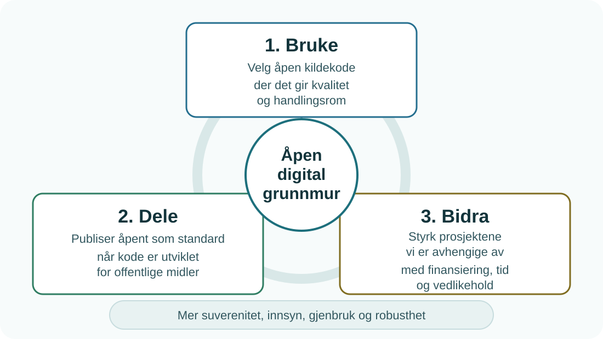

## Hvem er vi?
Arbeidsgruppen består av deltakere fra NAV, Norstella, UiO, Helsedirektoratet, Fiskeridirektoratet og Digdir. Gruppen skal bidra til at åpen kildekode blir et foretrukket valg ved utvikling og anskaffelse av nye offentlige løsninger.

Målet er at programvare utviklet for offentlige midler som hovedregel publiseres med åpen lisens, slik at offentlig sektor kan dele og gjenbruke mer på tvers. Hovedbegrunnelsen er ikke bare gjenbruk, selv om det ofte er en viktig gevinst. Den viktigste begrunnelsen er innsyn, transparens og mulighet for kontroll med digitale løsninger som brukes i offentlig forvaltning.   
Vi oppfordrer også virksomhetene i offentlig sektor til å bidra tilbake til utviklermiljøene som forvalter den digitale grunnmuren de selv bruker. 

Gruppen ble etablert i april 2026 og har frem mot sommeren jobbet med å sammenstille kunnskapsgrunnlag, lage utkast på en høynivå veileder, vurdere mulighet for en tilskuddsordning og andre type tiltak. Vi jobber nå med å ferdigstille utkast på veileder som blir sendt ut på høring til høsten.

## Bakgrunn

Offentlig sektor er i dag sterkt avhengig av et fåtall store, internasjonale programvareleverandører. Denne avhengigheten skaper leverandørinnlåsing, geopolitisk sårbarhet og begrenset handlingsrom. Flere europeiske land (Sveits, Frankrike, Tyskland, Italia, Nederland) og EU-kommisjonen har allerede iverksatt strategier for åpen kildekode i offentlig sektor for å møte disse utfordringene.

Arkitektur- og standardiseringsrådet (ASR) behandlet saken i oktober 2025, noe som førte til at Digdir satte ned en arbeidsgruppe som skulle jobbe etter tre anbafalte retninger:

<figure>
  
  <figcaption>Figur: Arbeidsgruppens tre anbefalinger for åpen kildekode i offentlig sektor.</figcaption>
</figure>

**Bruke: Åpen kildekode som foretrukket valg**

Ved nye anskaffelser og utviklingsløp bør åpen kildekode velges der det er mulig og gir ønsket kvalitet.

Når virksomheten skal dekke et nytt behov, bør åpne alternativer vurderes før det velges lukket løsning. Vurderingen bør omfatte funksjonalitet, sikkerhet, modenhet, forvaltning, kompetanse, kostnader og mulighet for videreutvikling.

**Dele: Åpent som standard**

Programvare utviklet for offentlige midler bør publiseres med åpen lisens som standard.

Åpen kildekode blir en gjenbrukbar gode dersom virksomheten deler tilgang til nødvendig dokumentasjon, testoppsett, konfigurasjon, rettigheter og mulighet til å bytte leverandør.

**Bidra: Sikre den digitale grunnmuren**

Hele den digitale infrastrukturen i offentlig sektor hviler på åpen kildekode-prosjekter. Mange av disse vedlikeholdes av enkeltpersoner eller små grupper uten stabil finansiering. Hvis disse forsvinner eller slutter å vedlikeholde, rammes alle som er avhengige av programvaren. Dette er en systemisk risiko.

## Status - og hvordan kan du bidra?

All informasjon på disse sidene er arbeidsdokumenter som er under arbeid. 
Vi tar gjerne imot tilbakemeldinger fra alle som er engasjerte i tematikken ☺️. Send tilbakemeldinger til oss via [diskusjonssiden på github](https://github.com/digdir/ASR/discussions/3) eller på [epost](mailto:nasjonalarkitektur@digdir.no). Det er også lov å åpne en pull-request mot repoet. Arbeidsgruppen vil vurdere eventuelle bidrag fortløpende. 
