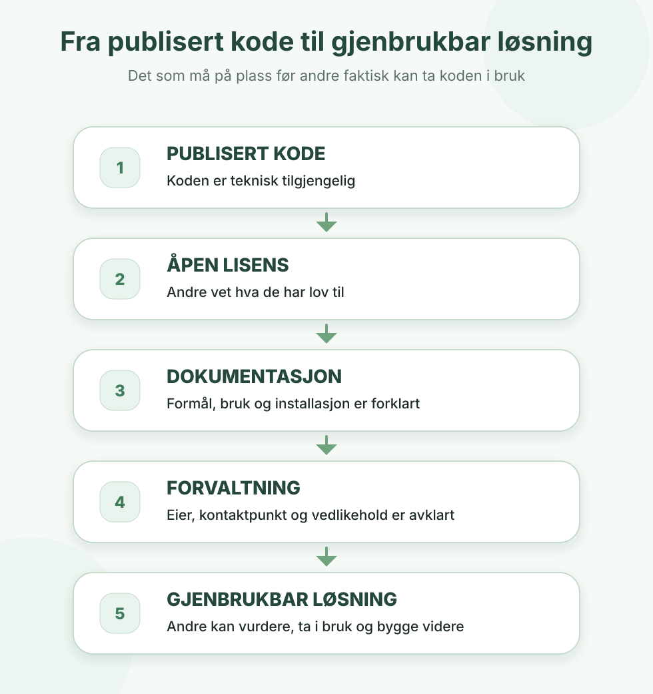
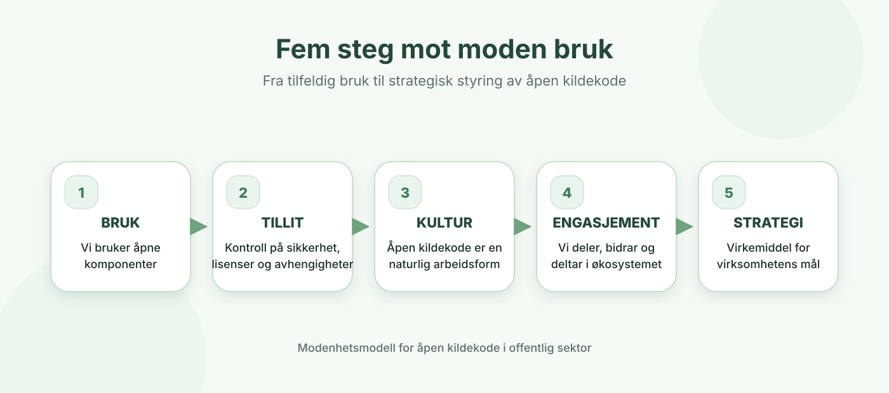

## Spørsmålet er ikke om, men hvordan (Hvorfor skal du bry deg?)
**Åpen kildekode kan gi store fordeler med tanke på at løsninger som utvikles i større grad kan gjenbrukes, og videreutvikles i felleskap. Videre så gir åpenheten større innsyn og kontroll for offentligheten. Denne etterprøvbarheten er vesentlig for ansvarlig utvikling av løsninger med komponenter av kunstig intelligens i offentlig sektor, og i det geopolitiske situasjonsbildet vi befinner oss i. Bruk av åpen kildekode åpner også for mer rettferdig konkurranse ved at tilbydere kan bygge videre på det som allerede eksisterer.** 

Mange offentlige virksomheter ønsker å bruke mer åpen kildekode, men diskusjonen blir ofte knyttet til risiko og sikkerhet. Samtidig er realiteten at de fleste digitale løsninger allerede er bygget på åpen kildekode gjennom leverandørene. Moderne web- og skyløsninger er ofte avhengige av hundrevis eller tusenvis av åpne komponenter fra tjenester som npmjs.com. Dersom én av disse inneholder sårbarheter eller blir kompromittert, kan det påvirke store deler av løsningen.
Utfordringer knyttet til programvareforsyningskjeden er derfor ikke noe man møter først når man velger å utvikle eller dele åpen kildekode, det er allerede en del av dagens digitale infrastruktur. Spørsmålet er derfor ikke om man bruker åpen kildekode, men hvordan man forvalter den på en ansvarlig måte.

Dette er også bakgrunnen for at EU, NIST og OpenSSF arbeider med krav og standarder for sikrere programvareleveranser, bedre oversikt over avhengigheter og mer bærekraftige open source-miljøer. Når offentlig sektor er avhengig av slike komponenter i stor skala, blir det også viktig å bidra tilbake gjennom finansiering, deling, vedlikehold og aktiv deltakelse i miljøene som utvikler og forvalter teknologien. (oppdatere tekst Hdir)

## Hva mener vi med åpen kildekode?
Åpen kildekode er programvare som gir tilgang til å fritt bruke, lese og dele kildekoden til programvaren. Dette brukes som betegnelse ettersom mange kommersielle programvareleverandører holder kildekoden sin hemmelig. Når kildekoden som offentlig sektor bruker i sine løsninger er åpen, har myndigheter, befolkning og leverandører innsyn i hvordan programvaren fungerer. 

Åpen kildekode innebærer at brukeren får innsyn i hvordan programvaren fungerer, og følgelig kan rette feil og gjøre forbedringer eller få noen andre til å gjøre dette for seg. Brukeren kan være et firma eller privatperson og kan eventuelt betale programvareutviklere for å skreddersy programvaren til sin bruk. Den forbedrede programvaren kan deles tilbake til offentligheten, og ideen er at det på denne måten vokser frem et «økosystem» av kvalitetssikret programvare som en fellesressurs. (oppdatere tekst Hdir)

## Tre vurderinger offentlige virksomheter må ta
### 1. Bruke: 
Virksomheten bør ha oversikt over hvilke åpne komponenter, rammeverk og plattformer den allerede bruker. Det gjelder både løsninger dere utvikler selv, og løsninger dere kjøper fra leverandører.

Å bruke åpen kildekode ansvarlig handler om mer enn å velge en teknologi. Dere bør vite hvilke avhengigheter løsningen har, hvilke lisenser som gjelder, hvordan sårbarheter følges opp, og om løsningen kan videreutvikles eller flyttes ved behov.

### 2. Dele: 
Når programvare utvikles for offentlige midler, bør virksomheten vurdere om koden kan publiseres åpent. Målet er ikke å åpne alt ukritisk, men å åpne så mye som mulig innenfor det som er forsvarlig.

Kode som deles bør være mulig å forstå, vurdere og ta i bruk. Det krever tydelig lisens, dokumentasjon, kontaktpunkt og avklart ansvar for videre forvaltning.

### 3. Bidra: 
Offentlig sektor er avhengig av åpne prosjekter som ofte vedlikeholdes av små miljøer. Hvis slike prosjekter svekkes eller forsvinner, kan det ramme mange offentlige tjenester samtidig.

Å bidra kan handle om mer enn kode. Det kan være feilretting, dokumentasjon, testing, sikkerhetsarbeid, finansiering, deltakelse i fagmiljøer eller at ansatte får tid til å bidra til prosjekter virksomheten er avhengig av.

## Hva får dere igjen?

### Mer kontroll over livsløpet
Digitale løsninger i offentlig sektor har ofte lang levetid – gjerne 10–20 år – og det er gjennom hele denne livssyklusen, ikke bare ved anskaffelsen, at kostnadene og risikoen faktisk påløper.

Med proprietær programvare er du prisgitt leverandørens valg gjennom hele løpet: når produktet videreutvikles, når det avvikles («end of life»), hvilke priser som gjelder ved fornyelse, og om du i det hele tatt får migrert dataene dine ut når avtalen tar slutt. Blir leverandøren kjøpt opp, endrer strategi eller går konkurs, kan en kritisk tjeneste stå uten vedlikehold over natten.

Åpen kildekode flytter kontrollen over livssyklusen til virksomheten selv. Selv om en leverandør trekker seg, finnes koden fortsatt, og en annen aktør kan ta over vedlikehold, feilretting og videreutvikling. Det betyr ikke at åpen kildekode er kostnadsfri – vedlikehold, sikkerhet og oppgradering av avhengigheter må finansieres 
uansett – men kostnaden blir synlig og styrbar i stedet for skjult i lisens- og avtalevilkår du ikke rår over.

I praksis bør virksomheten vurdere hele livsløpet allerede ved valg av løsning: ikke bare innkjøps- og utviklingskostnad, men også vedlikehold, kompetanse, migrering inn og ut, og hva en avvikling vil koste. For mange løsninger gir åpen kildekode bedre ressursutnyttelse over tid, selv om det sjelden gir lavere kostnad på dag én.  

### Mindre leverandørinnlåsing
Portabilitet handler om muligheten til å flytte løsninger, data og kompetanse mellom leverandører og plattformer uten å starte på nytt. Interoperabilitet handler om at systemer kan samhandle på tvers av virksomheter og forvaltningsnivåer. Begge deler svekkes når løsninger bygges lukket, og styrkes når de bygges åpent.

Når kildekoden er åpen og bygget på åpne standarder, reduseres innelåsingen til én leverandør. Du kan bytte leverandør, ta deler av forvaltningen inn selv, eller la flere aktører konkurrere om videreutvikling og drift. Det gir både bedre forhandlingsposisjon og lavere risiko for at løsningen blir en blindvei.

### Bedre gjenbruk på tvers
Mange offentlige virksomheter har overlappende behov, men løser dem hver for seg. Resultatet er at samme funksjonalitet utvikles, betales for og vedlikeholdes mange ganger parallelt. Åpen kildekode gjør det mulig å erstatte dette med gjenbruk: én virksomhet kan bygge en løsning åpent, og andre kan ta den i bruk eller bygge videre på den.

Gevinsten er størst når gjenbruk tenkes inn fra starten. En løsning som er publisert åpent, men uten dokumentasjon, lisens eller tydelig forvaltning, er teknisk tilgjengelig, men i praksis vanskelig å gjenbruke. Reell nyttiggjøring krever at andre kan finne løsningen, forstå hva den gjør, vurdere om den passer, og ta den i bruk uten å måtte kontakte utviklerne.

<figure class="ak-figure ak-figure--narrow">
  
</figure>

Gjenbruk er ikke bare god ressursbruk for den enkelte virksomhet; det er en samfunnsgevinst. Når flere bidrar til og bruker samme løsning, vokser det fram et felles økosystem av kvalitetssikret programvare som blir bedre og sikrere for alle som er avhengige av den.

### Mer etterprøvbare digitale tjenester
Åpen kildekode blir mer og mer vesentlig sett i lys av KI-drevet utvikling. En åpen kodebase er nærmest en forutsetning både for å gjøre det som lages etterprøvbart, forklarbart og for å kunne bruke KI-verktøy til kontinuerlig utvikling og forbedring. Dette fordi det er viktig med åpenhet og sporbarhet for hva KI-programvare som hjelper utvikleren med koding, testing, og dokumentasjon faktisk gjør, og fordi velregulert tilgang og definerte prosesser som åpen kildekode legger til rette for gir økt forklarbarhet rundt dette. 

### Sterkere digital beredskap
Åpen kildekode kan redusere sårbarhet ved at virksomheten ikke er like bundet til lukkede løsninger, enkeltleverandører eller utilgjengelig kompetanse. Det gir større handlefrihet ved teknologiske, økonomiske eller geopolitiske endringer.

## Hva må dere ha kontroll på?

### Sikkerhet og sårbarheter
Åpenhet kan styrke sikkerheten, men bare dersom virksomheten har gode rutiner.

Før kode publiseres må repository, dokumentasjon og historikk gjennomgås. Hemmeligheter, tilgangsnøkler, passord, tokens, personopplysninger og sensitiv konfigurasjon skal ikke publiseres.

Virksomheten bør bruke automatiserte verktøy for å oppdage sårbarheter, lisensutfordringer og hemmeligheter i kodebasen. Det bør også være tydelig hvordan eksterne kan melde fra om sikkerhetsproblemer.

### Lisenser og rettigheter
Virksomheten må vite hvilke rettigheter og plikter som følger med åpen kildekode den bruker. Kode som publiseres bør ha en tydelig lisens, og lisensvalg bør avklares tidlig.

### Dokumentasjon og forvaltning
Kode som deles uten dokumentasjon, lisens eller kontaktpunkt er vanskelig å gjenbruke. Et åpent repository bør minst ha README, LICENSE, informasjon om eierskap og en enkel beskrivelse av hvordan løsningen bygges, testes og forvaltes.

### Roller og ansvar
Det må være tydelig hvem som eier koden, hvem som kan godkjenne endringer, hvem som følger opp feil og sårbarheter, og hvem som svarer på spørsmål eller bidrag utenfra.x|    

### Kostnader over tid
Åpen kildekode er ikke gratis å forvalte. Drift, sikkerhet, oppgraderinger, dokumentasjon og vedlikehold krever kapasitet. Gevinsten er at kostnadene blir mer synlige og at virksomheten får større kontroll over dem.

(Norstella - leverandørperspektiv)

## Hvor modne er dere?

Vi kan skille mellom ulike grader av modenehet for åpen kildekode. Det finnes
flere modeller for beskrivelse av modenhet, én slik modell er skissert av OSPO
alliance ([Referanse](https://ospo-alliance.org/ggi/introduction/)).

Modellen modellen skisserer fem nivåer av modenhet: bruk, tillit, kultur,
engasjement og strategi.

På det laveste nivået har vi altså bruk av åpen kildekode i en organisasjon,
hvor man har tilstrekkelig kompetanse til å ta i bruk, men hovedsakelig er
konsument.

I neste nivå er det en økt bevisthet og kontrollerte rammer, slik som sikkerhet,
håndtering av avhengigheter, juridiske og økonomiske forhold.

På kulturnivået er en god praksis internalisert i organisasjonen, og det er
utviklet en intern kultur der åpen kildekode er en naturlig del av
arbeidsprosessen.

På de to øverste nivåene går vi til engasjement, hvor organisasjonen er aktiv
bidragsyter, enten ved å dele aktivt egene prosjekter, eller som bidragsyter i
eksterne prosjekter.

På det øverste nivået er åpen kildekode bevisst brukt som virkemiddel for å nå
organisasjonens overordnede mål. Her er åpen kildekode ikke bare et teknisk
valg, men også et strategisk valg forankret i øverste ledelse.

Åpen kildekode og åpne standarder utfyller hverandre: standardene legger til rette for at systemer kan snakke sammen, mens åpen kildekode gir innsyn i hvordan samhandlingen faktisk er implementert. For offentlig sektor, der tjenester ofte må utveksle data på tvers av etater, kommuner og forvaltningsnivåer, er dette en forutsetning for å unngå at hver virksomhet bygger sine egne, inkompatible siloer. (oppdatere tekst Digdir)

## Første steg: slik kommer dere i gang

Åpen kildekode er ikke et prosjekt med en startdato og en sluttdato – det er en arbeidsform som modnes over tid. Du trenger ikke å gjøre alt på én gang. Start der dere er. Velg én løsning, ett repository eller én anskaffelse der åpen kildekode kan vurderes. Bruk arbeidet til å etablere en enkel praksis for lisens, dokumentasjon, sikkerhet, ansvar og publisering.

Deretter kan virksomheten gradvis bygge modenhet: først oversikt over hva dere bruker, så rutiner for trygg bruk og publisering, og etter hvert mer aktiv gjenbruk, samarbeid og bidrag til prosjekter dere er avhengige av.

Lær underveis, og se på hva andre offentlige virksomheter gjør – flere har delt både kode og erfaringer åpent.

For at gjenbruk skal fungere i praksis bør virksomheten:

- skille tydelig mellom det som er generisk (og dermed gjenbrukbart) og det som er lokalt tilpasset
- publisere med åpen lisens og dokumentasjon som gjør løsningen mulig å ta i bruk for andre
- gjøre løsningen synlig der andre leter – for eksempel gjennom felles kataloger og oversikter over offentlige åpne prosjekter

(oppdatere tekst - Fiskeridirektoratet/UiO) 

## Sjekkliste før publisering eller anskaffelse
Her er de første grepene:

1. Avklar hva dere vil oppnå. Skal koden deles for transparens, ønsker dere aktive bidrag fra andre, eller er målet intern gjenbruk på tvers av team? Skriv målet ned i én setning, det blir rettesnoren for valg av lisens, dokumentasjonsnivå og forvaltningsmodell.
2. Få oversikt over det dere allerede bruker. De fleste løsningene deres er allerede bygget på åpen kildekode gjennom leverandørene. Skaff oversikt over hvilke åpne komponenter dere er avhengige av, det er en forutsetning for å håndtere både sikkerhet og lisenser.
3. Håndter lisenser tidlig. Velg én standardlisens for nye prosjekter (for eksempel MIT, Apache 2.0 eller EUPL 1.2), og etabler en rutine for å scanne og dokumentere tredjepartslisenser automatisk i byggeprosessen.
4. Sett en minimumsstandard for dokumentasjon. README med formål, installasjon og bruk; CONTRIBUTING med bidragsregler; LICENSE-fil; og en enkel arkitekturbeskrivelse. Bruk dette som sjekkliste før publisering.
5. Bygg sikkerhet inn i prosessen. Aktiver automatisk sårbarhetsskanning i alle repositorier, og etabler en fast rutine for å vurdere og oppgradere avhengigheter. Husk: hemmeligheter som nøkler, passord og tokens skal aldri publiseres, og kode må saneres før den åpnes.
6. Plassér ansvaret tydelig. Hvem eier beslutninger om koden, hvem følger opp sikkerhet, og hvem svarer eksterne bidragsytere? Rollene kan være deltid og kombineres i små team, men de må være navngitte og kjente.
7. For å lykkes med gjenbruk og samskaping  krevers både aktiv forvaltning, kvalitetssikring og kontinuerlig forbedring. Dette forutsetter kapasitet, engasjement og kontinuerlig utvikling. Kapasitet må brukes på å skape en god utvikleropplevelse for de som tar i koden i bruk eller som ønsker å bidra. Dette gjøres ved å ha åpne kanaler og prosesser for å ta imot forslag, kodebidrag, dokumentasjon, og feilhandtering.

Still krav om åpne, standardiserte grensesnitt (API-er) og dokumenterte dataformater i anskaffelser, og vurder hvor lett er det å komme seg ut igjen?

Før publisering eller anskaffelse bør dere kunne svare på:

- Hva er formålet med å åpne, bruke eller anskaffe åpen kildekode?
- Hvilke deler av løsningen kan publiseres forsvarlig?
- Er sikkerhet, personvern, taushetsplikt og nasjonale sikkerhetshensyn vurdert?
- Er hemmeligheter og sensitiv informasjon fjernet fra kode og historikk?
- Er lisens valgt og dokumentert?
- Er eierskap og forvaltningsansvar tydelig?
- Finnes nødvendig dokumentasjon?
- Er avhengigheter og tredjepartslisenser kartlagt?
- Er det rutiner for sårbarheter og oppdateringer?
- Ved anskaffelse: gir avtalen reell mulighet til innsyn, videreutvikling, datatilgang og leverandørbytte?

(oppdatere tekst - Fiskeridirektoratet/UiO) 

